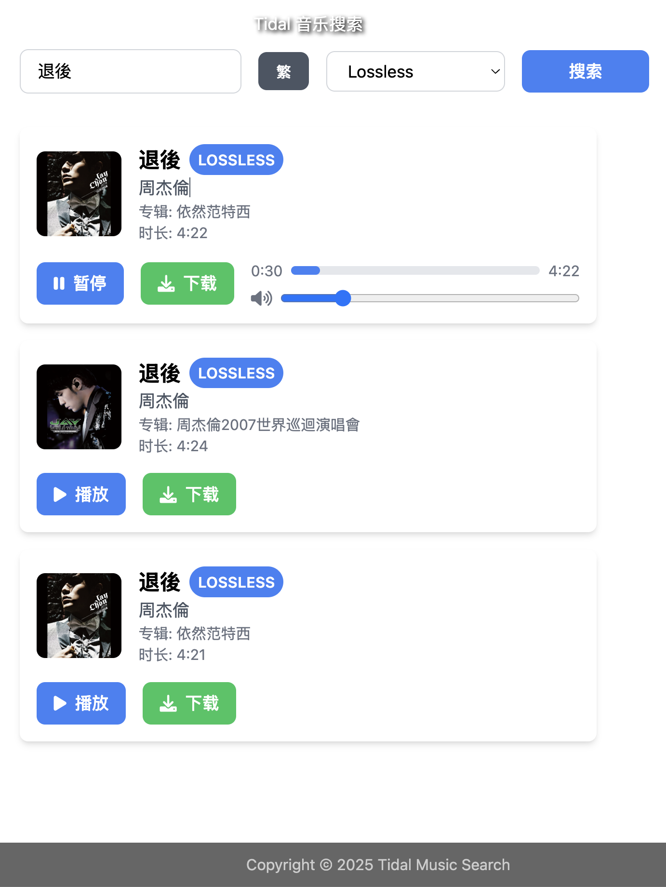

# Tidal 音乐搜索

一个简单易用的 Tidal 音乐搜索和下载工具，支持高品质音乐搜索、试听和下载。

## 功能特点

- 🎵 支持音乐搜索和在线试听
- 🎼 支持多种音质选择（HI_RES_LOSSLESS/HI_RES/LOSSLESS/HIGH/LOW）
- 📥 支持音乐下载，自动保存为对应音质格式
- 🎨 优雅的用户界面，支持随机音乐背景
- 🔄 支持简体/繁体中文切换
- 🎚️ 内置音量控制和进度条调节

## 跨平台支持

提供以下平台的预编译版本：

- Windows (64位)
- macOS (Intel/Apple Silicon)
- Linux (64位)

## 快速开始

1. 下载对应平台的可执行文件
2. 运行程序，默认会在 `http://localhost:9527` 启动 Web 界面
3. 在搜索框输入歌曲名称并回车
4. 点击播放按钮试听，或点击下载按钮保存音乐

## 构建输出

项目的构建输出文件位于 `build` 目录下：

- `tidal-download-darwin-amd64`: macOS Intel 平台可执行文件
- `tidal-download-darwin-arm64`: macOS Apple Silicon 平台可执行文件
- `tidal-download-linux-amd64`: Linux 64位平台可执行文件

## 技术栈

- 后端：Go
- 前端：Vue 3 + Tailwind CSS
- UI 组件：Font Awesome 图标

## 注意事项

- 本工具仅用于个人学习和研究使用
- 请遵守相关法律法规，不要进行商业用途的使用
- 音乐版权归原音乐公司所有

## 致谢

本项目使用了 [hifi-tui](https://github.com/sachinsenal0x64/hifi-tui) 项目提供的 Tidal API 接口，在此特别感谢该项目的贡献。

## 许可证

MIT License